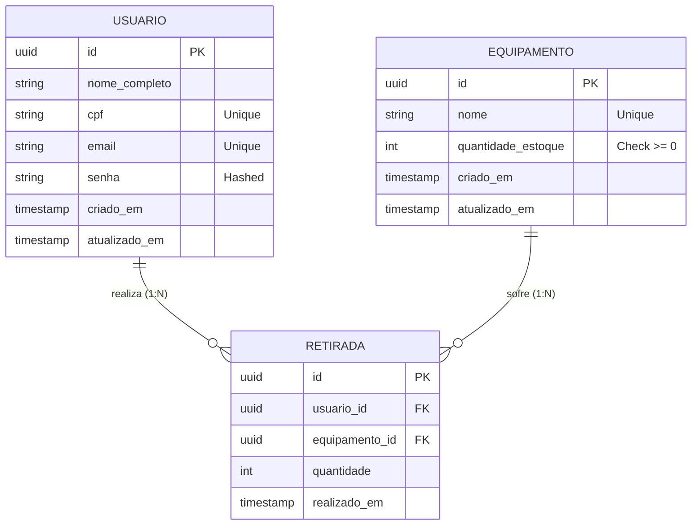

# Modelo de Dados (MER) - API Gestão de Estoque

Esta documentação descreve a estrutura do banco de dados, os relacionamentos entre as entidades e as regras de integridade aplicadas.

## 1. Diagrama de Entidade-Relacionamento (ERD)

Este diagrama utiliza a sintaxe [Mermaid](https://mermaid.js.org/) e é renderizado automaticamente pelo GitHub.

---

## 2. Dicionário de Dados

### 2.1. Tabela: `usuarios`
Armazena as informações dos operadores do sistema.

| Campo | Tipo | Restrições | Descrição |
| :--- | :--- | :--- | :--- |
| `id` | UUID | PK, Auto | Identificador único do usuário. |
| `nome_completo`| VARCHAR | NOT NULL | Nome completo do operador. |
| `cpf` | VARCHAR | UNIQUE, NOT NULL | CPF para identificação e login. |
| `email` | VARCHAR | UNIQUE, NOT NULL | E-mail corporativo. |
| `senha` | VARCHAR | NOT NULL | Hash da senha (BCrypt/Argon2). |
| `criado_em` | TIMESTAMP | DEFAULT NOW | Data de criação da conta. |
| `atualizado_em`| TIMESTAMP | DEFAULT NOW | Data da última alteração de perfil. |

### 2.2. Tabela: `equipamentos`
Cadastro central de itens disponíveis para retirada.

| Campo | Tipo | Restrições | Descrição |
| :--- | :--- | :--- | :--- |
| `id` | UUID | PK, Auto | Identificador único do equipamento. |
| `nome` | VARCHAR | UNIQUE, NOT NULL | Nome descritivo do item. |
| `quantidade_estoque`| INTEGER | DEFAULT 0, **>= 0** | Saldo atual disponível. |
| `criado_em` | TIMESTAMP | DEFAULT NOW | Data de cadastro. |
| `atualizado_em`| TIMESTAMP | DEFAULT NOW | Data da última movimentação ou edição. |

### 2.3. Tabela: `retiradas`
Log de transações de saída de materiais.

| Campo | Tipo | Restrições | Descrição |
| :--- | :--- | :--- | :--- |
| `id` | UUID | PK, Auto | Identificador da transação. |
| `usuario_id` | UUID | FK -> usuarios(id) | Quem realizou a retirada. |
| `equipamento_id`| UUID | FK -> equipamentos(id) | Qual item foi retirado. |
| `quantidade` | INTEGER | NOT NULL, > 0 | Quantidade movimentada. |
| `realizado_em` | TIMESTAMP | DEFAULT NOW | Data e hora exata da operação. |

---

## 3. Regras de Integridade e Negócio

1.  **Estoque Positivo:** A tabela `equipamentos` possui uma constraint de banco (`CHECK "quantidade_estoque" >= 0`) que impede que qualquer operação (como uma retirada maior que o saldo) deixe o estoque negativo.
2.  **Rastreabilidade:** Toda `retirada` exige obrigatoriamente um `usuario_id` e um `equipamento_id` válidos, garantindo que não existam registros órfãos.
3.  **Identificação Única:** CPF e Email são campos `UNIQUE`, impedindo duplicidade de usuários no sistema.
